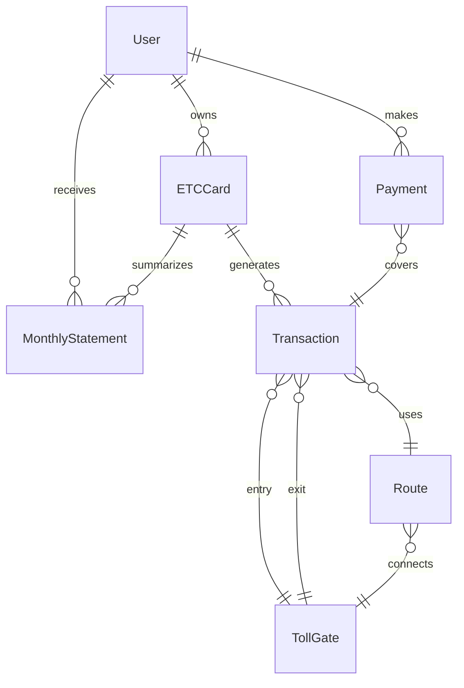

# Data Model: gRPC-First Multi-Protocol Gateway with db_service Integration

## db_service Entities

### ETCMeisai
ETC明細 (toll details) from db_service.

```go
type ETCMeisai struct {
    ID         int64   `json:"id" gorm:"primaryKey"`
    DateFr     *string `json:"date_fr,omitempty"`     // 開始日
    DateTo     string  `json:"date_to"`                // 終了日
    DateToDate string  `json:"date_to_date"`           // 終了日付
    IcFr       string  `json:"ic_fr"`                  // 入口IC
    IcTo       string  `json:"ic_to"`                  // 出口IC
    PriceBf    *int32  `json:"price_bf,omitempty"`     // 割引前料金
    Descount   *int32  `json:"descount,omitempty"`     // 割引額
    Price      int32   `json:"price"`                  // 料金
    Shashu     int32   `json:"shashu"`                 // 車種
    CarIdNum   *int32  `json:"car_id_num,omitempty"`   // 車両ID
    EtcNum     string  `json:"etc_num"`                // ETCカード番号
    Detail     *string `json:"detail,omitempty"`       // 詳細
    Hash       string  `json:"hash"`                   // ハッシュ値
}
```

### DTakoUriageKeihi
経費精算 (expense settlement) data.

```go
type DTakoUriageKeihi struct {
    SrchId          string   `json:"srch_id" gorm:"primaryKey"`
    Datetime        string   `json:"datetime"`               // RFC3339形式
    KeihiC          int32    `json:"keihi_c"`               // 経費コード
    Price           float64  `json:"price"`                 // 金額
    Km              *float64 `json:"km,omitempty"`          // 距離
    DtakoRowId      string   `json:"dtako_row_id"`          // DTakoID
    DtakoRowIdR     string   `json:"dtako_row_id_r"`        // DTakoID参照
    StartSrchId     *string  `json:"start_srch_id,omitempty"`
    StartSrchTime   *string  `json:"start_srch_time,omitempty"`
    StartSrchPlace  *string  `json:"start_srch_place,omitempty"`
    EndSrchId       *string  `json:"end_srch_id,omitempty"`
    EndSrchTime     *string  `json:"end_srch_time,omitempty"`
    EndSrchPlace    *string  `json:"end_srch_place,omitempty"`
    Note            *string  `json:"note,omitempty"`
}
```

### DTakoFerryRows
フェリー運行 (ferry operations) data.

```go
type DTakoFerryRows struct {
    ID           int32  `json:"id" gorm:"primaryKey"`
    UnkoNo       string `json:"unko_no"`        // 運行NO
    UnkoDate     string `json:"unko_date"`      // 運行日
    YomitoriDate string `json:"yomitori_date"`  // 読取日
    JigyoshoCd   int32  `json:"jigyosho_cd"`    // 事業所CD
    JigyoshoName string `json:"jigyosho_name"`  // 事業所名
    SharyoCd     int32  `json:"sharyo_cd"`      // 車輌CD
    SharyoName   string `json:"sharyo_name"`    // 車輌名
    JomuinCd1    int32  `json:"jomuin_cd1"`     // 乗務員CD1
    JomuinName1  string `json:"jomuin_name1"`   // 乗務員名１
}
```

### ETCMeisaiMapping
Mapping between ETC明細 and DTako systems.

```go
type ETCMeisaiMapping struct {
    ID            int64   `json:"id" gorm:"primaryKey"`
    EtcMeisaiHash string  `json:"etc_meisai_hash"` // ETC明細ハッシュ
    DtakoRowId    string  `json:"dtako_row_id"`    // DTako行ID
    CreatedAt     string  `json:"created_at"`
    UpdatedAt     string  `json:"updated_at"`
    CreatedBy     string  `json:"created_by"`
    Notes         *string `json:"notes,omitempty"`
}
```

## Core Entities

### User
Represents a registered ETC system user.

```go
type User struct {
    ID           string    `json:"id" gorm:"primaryKey"`
    Email        string    `json:"email" gorm:"uniqueIndex"`
    Name         string    `json:"name"`
    PhoneNumber  string    `json:"phone_number"`
    Address      string    `json:"address"`
    CreatedAt    time.Time `json:"created_at"`
    UpdatedAt    time.Time `json:"updated_at"`
    Status       string    `json:"status"` // active, suspended, deleted
}
```

**Validation Rules**:
- Email must be valid format
- PhoneNumber must be Japanese format
- Status must be one of: active, suspended, deleted

### ETCCard
Electronic toll collection card associated with a user.

```go
type ETCCard struct {
    ID             string    `json:"id" gorm:"primaryKey"`
    UserID         string    `json:"user_id" gorm:"index"`
    CardNumber     string    `json:"card_number" gorm:"uniqueIndex"`
    ExpiryDate     time.Time `json:"expiry_date"`
    Status         string    `json:"status"` // active, suspended, expired
    VehicleNumber  string    `json:"vehicle_number"`
    VehicleType    string    `json:"vehicle_type"` // regular, kei, large
    CreatedAt      time.Time `json:"created_at"`
    ActivatedAt    *time.Time `json:"activated_at"`
    DeactivatedAt  *time.Time `json:"deactivated_at"`
}
```

**Validation Rules**:
- CardNumber must be 16 digits
- ExpiryDate must be future date
- VehicleType affects toll calculation

### Transaction
Toll transaction record for highway usage.

```go
type Transaction struct {
    ID               string    `json:"id" gorm:"primaryKey"`
    CardID           string    `json:"card_id" gorm:"index"`
    EntryGateID      string    `json:"entry_gate_id"`
    ExitGateID       string    `json:"exit_gate_id"`
    EntryTime        time.Time `json:"entry_time"`
    ExitTime         time.Time `json:"exit_time"`
    Distance         float64   `json:"distance"` // in kilometers
    TollAmount       int64     `json:"toll_amount"` // in yen
    DiscountAmount   int64     `json:"discount_amount"`
    FinalAmount      int64     `json:"final_amount"`
    PaymentStatus    string    `json:"payment_status"` // pending, completed, failed
    TransactionDate  time.Time `json:"transaction_date"`
}
```

**Business Rules**:
- TollAmount calculated based on distance and vehicle type
- Discounts apply for time-of-day and frequency
- FinalAmount = TollAmount - DiscountAmount

### TollGate
Highway entry/exit points.

```go
type TollGate struct {
    ID           string  `json:"id" gorm:"primaryKey"`
    Name         string  `json:"name"`
    HighwayCode  string  `json:"highway_code"`
    Direction    string  `json:"direction"` // inbound, outbound
    Latitude     float64 `json:"latitude"`
    Longitude    float64 `json:"longitude"`
    IsActive     bool    `json:"is_active"`
}
```

### Route
Calculated route between toll gates.

```go
type Route struct {
    ID              string  `json:"id" gorm:"primaryKey"`
    EntryGateID     string  `json:"entry_gate_id"`
    ExitGateID      string  `json:"exit_gate_id"`
    Distance        float64 `json:"distance"`
    BaseToll        int64   `json:"base_toll"`
    TimeEstimate    int     `json:"time_estimate"` // in minutes
}
```

### Payment
Payment records for transactions.

```go
type Payment struct {
    ID              string    `json:"id" gorm:"primaryKey"`
    UserID          string    `json:"user_id" gorm:"index"`
    TransactionIDs  []string  `json:"transaction_ids" gorm:"type:json"`
    TotalAmount     int64     `json:"total_amount"`
    PaymentMethod   string    `json:"payment_method"` // credit_card, bank_transfer
    PaymentDate     time.Time `json:"payment_date"`
    Status          string    `json:"status"` // pending, completed, failed
    ReferenceNumber string    `json:"reference_number"`
}
```

### MonthlyStatement
Monthly usage summary for billing.

```go
type MonthlyStatement struct {
    ID               string    `json:"id" gorm:"primaryKey"`
    UserID           string    `json:"user_id" gorm:"index"`
    CardID           string    `json:"card_id" gorm:"index"`
    Year             int       `json:"year"`
    Month            int       `json:"month"`
    TotalTrips       int       `json:"total_trips"`
    TotalDistance    float64   `json:"total_distance"`
    TotalAmount      int64     `json:"total_amount"`
    DiscountAmount   int64     `json:"discount_amount"`
    FinalAmount      int64     `json:"final_amount"`
    GeneratedAt      time.Time `json:"generated_at"`
    PaymentDueDate   time.Time `json:"payment_due_date"`
}
```

## Relationships



## State Transitions

### ETCCard Status
```
[Created] -> [Active] -> [Suspended] -> [Active]
                     \-> [Expired]
```

### Transaction Payment Status
```
[Pending] -> [Completed]
         \-> [Failed] -> [Pending]
```

### Payment Status
```
[Pending] -> [Processing] -> [Completed]
                         \-> [Failed]
```

## Aggregates

### UserAggregate
- Root: User
- Includes: ETCCards, Payments, MonthlyStatements
- Invariants: User must have at least one active payment method

### TransactionAggregate
- Root: Transaction
- Includes: Route, TollGates
- Invariants: Exit time must be after entry time

### BillingAggregate
- Root: MonthlyStatement
- Includes: Transactions, Payments
- Invariants: Statement total must match sum of transactions

## Database Indices

```sql
-- Performance critical queries
CREATE INDEX idx_transactions_card_date ON transactions(card_id, transaction_date);
CREATE INDEX idx_transactions_payment_status ON transactions(payment_status);
CREATE INDEX idx_payments_user_status ON payments(user_id, status);
CREATE INDEX idx_statements_user_period ON monthly_statements(user_id, year, month);
CREATE INDEX idx_cards_user_status ON etc_cards(user_id, status);
```

## Proto Message Mappings

Each entity maps to Protocol Buffer messages:
- User -> `User` message in user.proto
- ETCCard -> `ETCCard` message in card.proto
- Transaction -> `Transaction` message in transaction.proto
- Route -> `Route` message in route.proto
- Payment -> `Payment` message in payment.proto
- MonthlyStatement -> `Statement` message in billing.proto

## Caching Strategy

### Cache Keys
- User: `user:{id}`
- Card: `card:{id}`
- User's cards: `user:cards:{user_id}`
- Transaction: `transaction:{id}`
- Recent transactions: `card:transactions:{card_id}:recent`
- Monthly statement: `statement:{user_id}:{year}:{month}`

### TTL Values
- User data: 1 hour
- Card data: 1 hour
- Transactions: 24 hours
- Statements: 7 days
- Routes: 24 hours (static data)